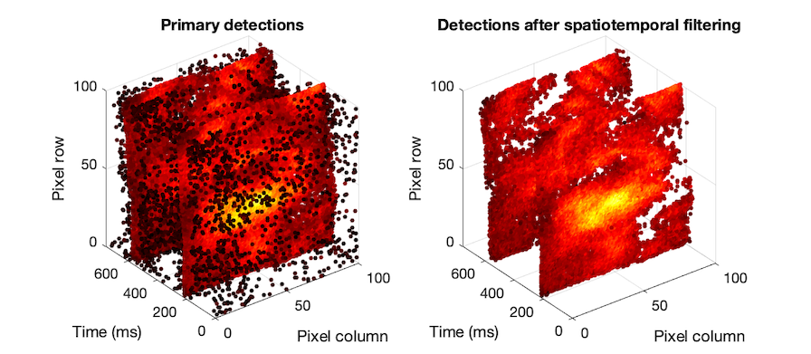

# OMActivations

This repository contains MATLAB scripts with implementation of the method for detection of activations in optical mapping recordings of atrial fibrillation.
This software is licensed under the GNU GPL v3. In case of any questions please contact vladimir.sobota@ihu-liryc.fr.

## Download and first run
Download/clone the repository `OMActivations`. Unzip the file and open `run.m`. If the script is executed well it should generate the following graph:



## Using RSH file as input
The function `readOMAData.m` uses an RSH file as input. If you want to load an RSH file, just uncomment the following code in the **Data load** section:

```
% Load RHS file
%{
path = 'data';                                      % path to the file
name = 'sample_file.rsh';                           % name of the RSH file
fprintf('Loading data:\n');
[dataTemp, dataInfo]    = readOMAData(path, name);  % load data
dataOMA                 = -dataTemp(:,1:1e4);       % select just the image data   
fprintf('\nDone!\n');
%}
```
The code above generates two variables:

`dataOMA` - A two-dimensional array with each row representing a time frame and each column representing a pixel. 

`dataInfo` - A structure with information from the RSH file header that contains the following fields:
* `acquisitionDate` - date of acquisition
* `N_frames` - number of time frames
* `sampleTime` - duration of one time sample (in seconds)
* `f_sampl` - sampling frequency (Hz)
* `backgroundImg` - background image
* `dataFiles` - cell array containing names of RSD files that were containing the data

Please note that `dataInfo.N_frames` and `dataInfo.f_sample` are used as inputs of some functions in the script.

## Using MAT file as input
The script has been optimized for processing optical mapping files with 100x100 pixels, stored as two-dimensional arrays with each row representing a time frame and each column representing a pixel. You can directly load MAT files containing the variables `dataOMA` and `dataInfo`. A file `sample_data_AF.mat` is provided as an example and is loaded in the **Data load** section:

```
% Load MAT data
%
path = 'data';
name = 'sample_data_AF.mat';
load(fullfile(path,name));
%}
```

## Compatibility with MATLAB versions
The scripts should be compatible with MATLAB 2016a or later. Previous MATLAB releases have not been tested. The latest release has been tested on MATLAB 2021a. 
